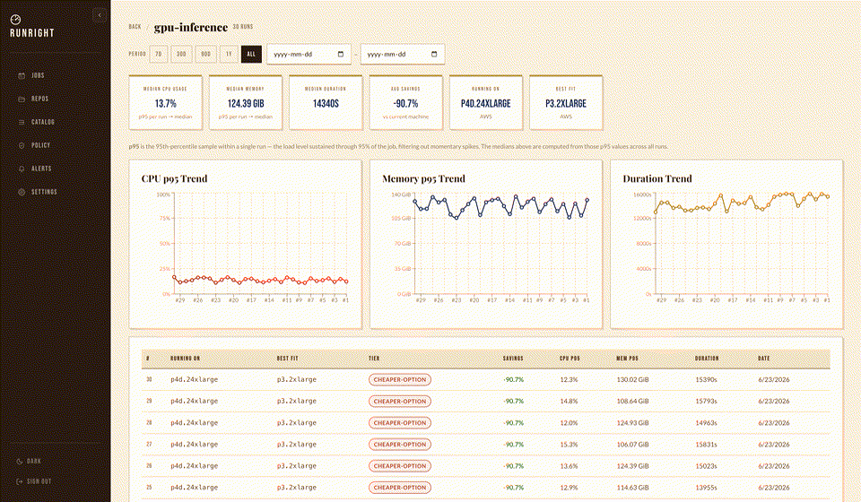
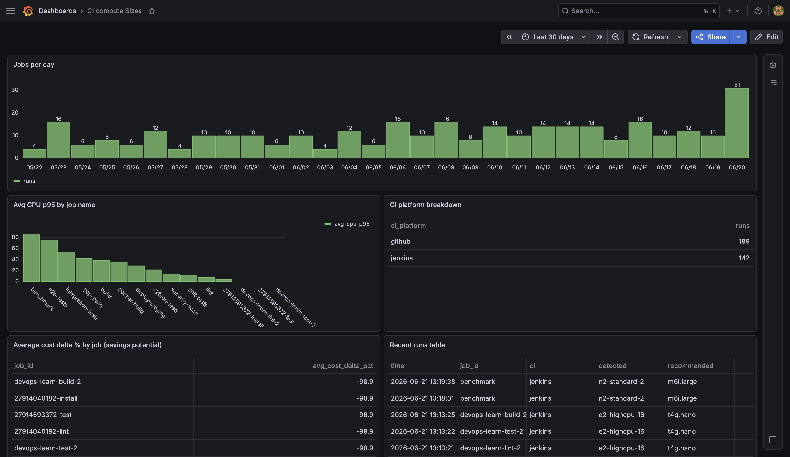

<p align="center">
  
</p>

<h1 align="center">RunRight</h1>

<p align="center"><strong>Right-size your CI machines.</strong> RunRight runs alongside every CI job, samples CPU/memory/disk/threads, and recommends the cheapest AWS or GCP instance that still fits your workload.</p>

<p align="center">Self-hosted · ELv2 · No SaaS · Container-aware (cgroup v2/v1)</p>

---

## Why RunRight

Grafana, Datadog, and Sentry tell you how your application behaves. They do not tell you whether you are paying for the right machine. **RunRight solves that: given your actual p95 CPU and memory usage, it recommends the cheapest AWS or GCP instance type that still fits your workload.**

### Key Features

- **No code changes.** Runs as a sidecar—not an SDK or agent you instrument. Drop it in any CI pipeline.
- **Minimal overhead.** Polls `/proc` every 5s. Footprint: under 5 MB RSS, under 0.1% CPU. Your builds stay fast.
- **Actionable insights.** Get specific instance recommendations with cost delta and tier labels—no graphs to interpret.
- **Works with your stack.** Exports via OTLP, Prometheus, or JSON. Integrates with Datadog, Grafana Cloud, or any observability tool.

---

## In action

<p align="center"><sub>Live product tour: dashboard, run insights, recommendations, and job history</sub></p>



<p align="center"><sub>Pipe your data into Grafana, Datadog, or any metrics tool. Raw runs land in Postgres.</sub></p>
<p align="center">
  
</p>

---

## Install

**Binary — macOS / Linux**

```bash
curl -fsSL \
  "https://github.com/gbudjeakp/run-right/releases/latest/download/runright_$(uname -s | tr '[:upper:]' '[:lower:]')_$(uname -m | sed 's/x86_64/amd64/').tar.gz" \
  | tar -xz && sudo mv runright /usr/local/bin/
```

**GitHub Actions** — no install needed, use the action directly:

```yaml
- uses: gbudjeakp/run-right@v1
  with:
    run: make build
```

**Docker Compose** — self-hosted dashboard + API + Postgres:

```bash
export RUNRIGHT_API_KEY=$(openssl rand -hex 32)
docker compose up -d
```

| Service | URL |
|---------|-----|
| Dashboard | http://localhost:3000 |
| API | http://localhost:8080 |
| PostgreSQL | localhost:5435 |

**Already using Datadog, Grafana Cloud, New Relic, or any OTLP tool?** Skip the backend entirely — point RunRight at your existing collector:

```bash
OTEL_EXPORTER_OTLP_ENDPOINT=https://your-collector:4317 \
  runright monitor --export otlp --job-id my-build
```

**Using Prometheus?**

```bash
runright monitor --export prometheus --prometheus-port 9090
```

---

## Add to CI

**GitHub Actions**

Two usage modes:

**Wrapper mode** (simplest) — wraps a single command:
```yaml
- uses: gbudjeakp/run-right@v1
  with:
    run: make build
```

**Standalone mode** — monitors across multiple steps:
```yaml
- uses: gbudjeakp/run-right@v1
  with:
    step: start

- run: make build
- run: make test

- uses: gbudjeakp/run-right@v1
  with:
    step: stop
```

**Send to an OTLP collector** (Datadog, Grafana Cloud, New Relic, etc.):
```yaml
- uses: gbudjeakp/run-right@v1
  with:
    run: make build
    export: otlp
  env:
    OTEL_EXPORTER_OTLP_ENDPOINT: ${{ vars.OTEL_ENDPOINT }}
    OTEL_EXPORTER_OTLP_HEADERS: "Authorization=Bearer ${{ secrets.OTEL_TOKEN }}"
```

**Send to self-hosted RunRight Platform:**
```yaml
- uses: gbudjeakp/run-right@v1
  with:
    run: make build
    export: http
    http-url: ${{ vars.RUNRIGHT_URL }}
  env:
    RUNRIGHT_API_KEY: ${{ secrets.RUNRIGHT_API_KEY }}
```

**Use step outputs** (e.g. in a subsequent step or job):
```yaml
- uses: gbudjeakp/run-right@v1
  id: rr
  with:
    run: make build

- run: echo "Suggested machine: ${{ steps.rr.outputs.suggested-machine }}"
```

### Action inputs

| Input | Default | Description |
|-------|---------|-------------|
| `run` | — | Command to wrap *(wrapper mode)* |
| `step` | — | `start` or `stop` *(standalone mode)* |
| `export` | `file` | Export backends: `file`, `otlp`, `http`, `prometheus` (comma-separated) |
| `interval` | `5s` | Metrics sampling interval |
| `duration` | `0` (unlimited) | Max monitoring duration, e.g. `30m` |
| `job-id` | `${{ github.job }}` | Unique identifier for this run |
| `output-dir` | `.runright/` | Directory to write metrics files |
| `http-url` | — | RunRight Platform URL for `http` export |
| `upload-artifact` | `true` | Upload metrics files as a GitHub Artifact |
| `pr-comment` | `true` | Post recommendation as a PR comment |
| `github-token` | `${{ github.token }}` | Token used to post PR comments |
| `provider` | *(all)* | Filter recommendations: `aws`, `gcp`, or `github` |
| `version` | `latest` | RunRight binary version to download |

### Action outputs

| Output | Description |
|--------|-------------|
| `recommendation-json` | Full JSON array of machine recommendations |
| `suggested-machine` | Top recommended machine ID (e.g. `t3.medium`) |
| `detected-machine` | Machine type detected at runtime |
| `artifact-url` | URL of the uploaded metrics artifact |

**Jenkins**
```groovy
sh '''
  OTEL_EXPORTER_OTLP_ENDPOINT=$OTEL_ENDPOINT \
  $RUNRIGHT_BIN monitor --export otlp \
    --job-id "$JOB_NAME-$BUILD_NUMBER" --interval 3s &
  RR_PID=$!
  make build
  kill $RR_PID
'''
```

**Kubernetes**: set pod resource limits and RunRight reads them via cgroup v2:
```yaml
resources:
  limits:
    cpu: "2"
    memory: "2Gi"
env:
  - name: RUNRIGHT_VCPUS
    valueFrom:
      resourceFieldRef: { resource: limits.cpu }
  - name: RUNRIGHT_MEMORY_GIB
    valueFrom:
      resourceFieldRef: { resource: limits.memory, divisor: 1Gi }
```

---

| Tier | Meaning |
|------|---------|
| `right-sized` | Current machine fits well |
| `cheaper` | A smaller instance meets headroom needs |
| `more-headroom` | Current machine is too small |

Catalog: **160+ AWS** and **60+ GCP** instance types, matched at p95 CPU + memory with 20%/30% headroom buffers.

---

## Grafana

A pre-built dashboard is included in `grafana/`. Mount it with Docker Compose and it auto-provisions against your RunRight PostgreSQL:

```bash
cd grafana && docker compose up -d
# Dashboard at http://localhost:3001  (admin / runright)
```

Panels: jobs/day · avg CPU p95 by job · CI platform breakdown · cost savings potential · recent runs table · CPU trend by CI platform.

---

## CLI

```
runright monitor   [--duration D] [--interval I] [--export file,http,otlp,prometheus] [--job-id ID] [--http-url URL]
runright recommend [--metrics FILE] [--provider aws|gcp] [--format table|json]
runright catalog list [--provider aws|gcp] [--family NAME] [--arch x86_64|arm64]
runright serve     [--port 8080]
```

---

## Dev

```bash
make build              # local binary
make build-linux        # linux/amd64 + linux/arm64
make build-all          # all 5 platforms
go test ./internal/...
cd web && pnpm dev
```

### Backend Hot Reload (Docker)

Use the dev profile to run the backend with live reload via Air:

```bash
docker compose up -d postgres dashboard
docker compose --profile dev up -d backend-dev
```

Now backend code changes reload automatically. You do not need `docker compose down` each time.

If `backend` is already running, stop only that service first:

```bash
docker compose stop backend
docker compose rm -f backend
```

---

Elastic License 2.0 (ELv2). See [LICENSE](LICENSE)
