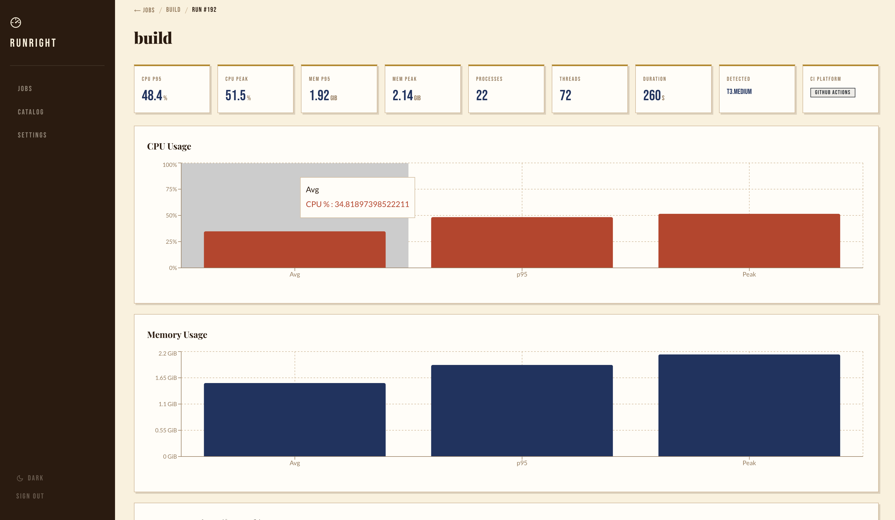
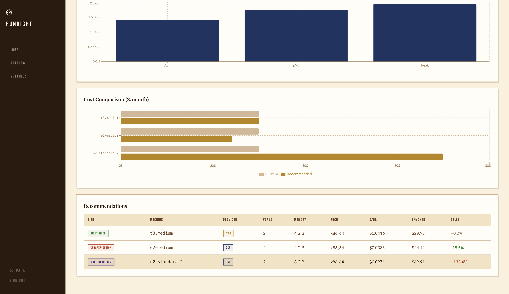
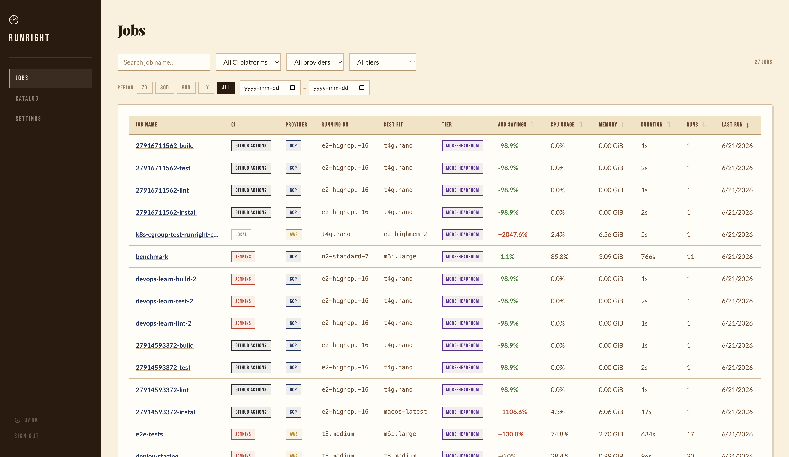
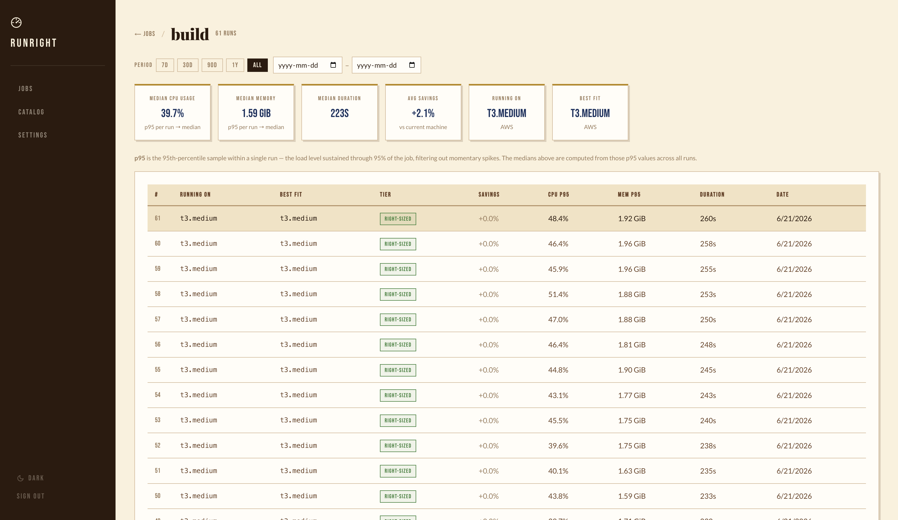

<p align="center">
  
</p>

<h1 align="center">RunRight</h1>

<p align="center"><strong>Right-size your CI machines.</strong> RunRight runs alongside every CI job, samples CPU/memory/disk/threads, and recommends the cheapest AWS or GCP instance that still fits your workload.</p>

<p align="center">Self-hosted · MIT · No SaaS · Container-aware (cgroup v2/v1)</p>

---

## Screenshots

<p align="center">
  
  
</p>
<p align="center">
  
  
</p>
<p align="center">
  
</p>

---

## Start in 2 steps

```bash
export RUNRIGHT_API_KEY=$(openssl rand -hex 32)
docker compose up -d
```

| Service | URL |
|---------|-----|
| Dashboard | http://localhost:3000 |
| API | http://localhost:8080 |
| PostgreSQL | localhost:5435 |

---

## Add to CI

**GitHub Actions**
```yaml
- uses: gbudjeakp/run-right@v1
  with:
    run: make build
    export: file,http
    http-url: ${{ vars.RUNRIGHT_URL }}
  env:
    RUNRIGHT_API_KEY: ${{ secrets.RUNRIGHT_API_KEY }}
```

**Jenkins**
```groovy
sh '''
  $RUNRIGHT_BIN monitor --export http --http-url $RUNRIGHT_URL \
    --job-id "$JOB_NAME-$BUILD_NUMBER" --interval 3s &
  RR_PID=$!
  make build
  kill $RR_PID
'''
```

**Kubernetes** — set pod resource limits and RunRight reads them via cgroup v2:
```yaml
resources:
  limits:
    cpu: "2"
    memory: "2Gi"
env:
  - name: RUNRIGHT_VCPUS
    valueFrom:
      resourceFieldRef: { resource: limits.cpu }
  - name: RUNRIGHT_MEMORY_GIB
    valueFrom:
      resourceFieldRef: { resource: limits.memory, divisor: 1Gi }
```

---

## Recommendation tiers

| Tier | Meaning |
|------|---------|
| `right-sized` | Current machine fits well |
| `cheaper` | A smaller instance meets headroom needs |
| `more-headroom` | Current machine is too small |

Catalog: **160+ AWS** and **60+ GCP** instance types, matched at p95 CPU + memory with 20%/30% headroom buffers.

---

## Grafana

A pre-built dashboard is included in `grafana/`. Mount it with Docker Compose and it auto-provisions against your RunRight PostgreSQL:

```bash
cd grafana && docker compose up -d
# Dashboard at http://localhost:3001  (admin / runright)
```

Panels: jobs/day · avg CPU p95 by job · CI platform breakdown · cost savings potential · recent runs table · CPU trend by CI platform.

---

## Project layout

```
cmd/runright/       CLI entry point
internal/
  agent/            Metrics collector + cgroup-aware machine detection
  catalog/          Embedded AWS + GCP machine catalog
  engine/           Recommender + tier classification
  exporter/         OTLP / Prometheus / HTTP backends
  server/           Gin REST API + PostgreSQL
  types/            Shared types
web/                React dashboard (Vite + recharts)
grafana/            Docker Compose + provisioned Grafana dashboard
docs/               Full setup reference
```

---

## CLI

```
runright monitor   [--duration D] [--interval I] [--export file,http,otlp,prometheus] [--job-id ID] [--http-url URL]
runright recommend [--metrics FILE] [--provider aws|gcp] [--format table|json]
runright catalog list [--provider aws|gcp] [--family NAME] [--arch x86_64|arm64]
runright serve     [--port 8080]
```

---

## Dev

```bash
make build              # local binary
make build-linux        # linux/amd64 + linux/arm64
make build-all          # all 5 platforms
go test ./internal/...
cd web && pnpm dev
```

Full setup guide: [docs/setup.md](docs/setup.md)

---

MIT — see [LICENSE](LICENSE)
